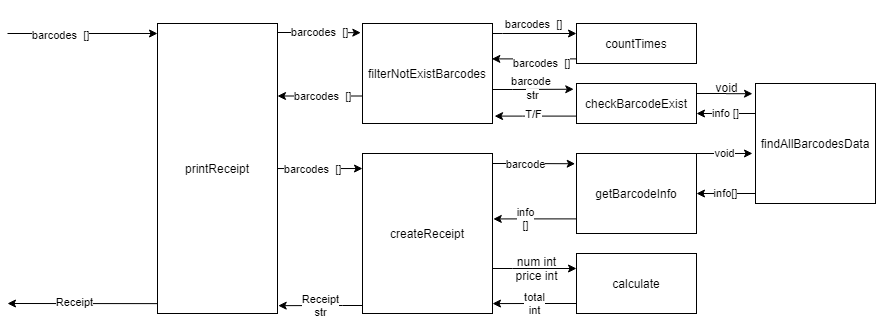

# context map

|  createReceipt()   | Description  |
|  ----  | ----  |
| P  | 10 mins |
| D  | 30 mins |
| C  | 字符串拼接转义字符的问题 |
| A  | 换用字符串模板 |

|  printReceipt()   | Description  |
|  ----  | ----  |
| P  | 3mins |
| D  | 2 mins |
| C  | none |
| A  | none |

|  filterNotExistBarcodes()   | Description  |
|  ----  | ----  |
| P  | 10 mins |
| D  | 8 mins |
| C  | none |
| A  | none |

|  getBarcodeInfo()   | Description  |
|  ----  | ----  |
| P  | 5 mins |
| D  | 4 mins |
| C  | none |
| A  | none |

|  calculate()   | Description  |
|  ----  | ----  |
| P  | 1 mins |
| D  | 1 mins |
| C  | none |
| A  | none |

|  findAllBarcodesData()   | Description  |
|  ----  | ----  |
| P  | 1 mins |
| D  | 5 mins |
| C  | 一开始没有找到数据，后来发现数据在read.me上 |
| A  | 注意看文档 |

|  checkBarcodeExist()   | Description  |
|  ----  | ----  |
| P  | 5 mins |
| D  | 3 mins |
| C  | none |
| A  | none |

|  countTimes()   | Description  |
|  ----  | ----  |
| P  | 5 mins |
| D  | 10 mins |
| C  | 不知道json怎么判断是否包含某个key值 |
| A  | 查询得到json对象有判断是否包含某个key的函数 |
